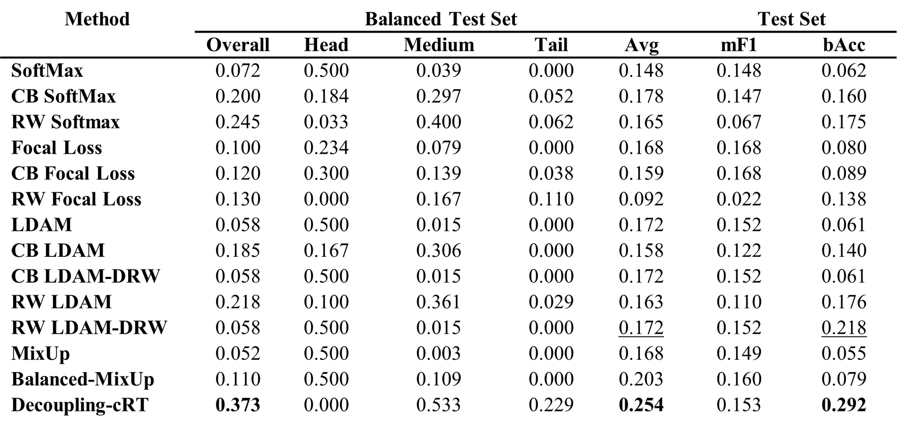
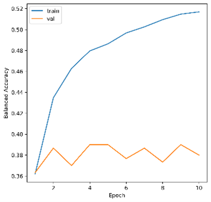

Student: Hojae Lee

Email: <iceanon1@khu.ac.kr>

**Replication Report of**

**“Long-Tailed Classification of Thorax Diseases on Chest X-Ray: A New Benchmark Study”**

**1\. Introduction**

In recent years, machine learning, particularly deep learning, has shown significant potential in medical image classification. However, these methods often struggle with long-tailed (LT) distributions, where a few classes dominate the dataset while many classes have scarce examples. The paper "Long-Tailed Classification of Thorax Diseases on Chest X-Ray: A New Benchmark Study" addresses this challenge by presenting a comprehensive benchmark for LT learning in the domain of thorax disease classification. This report is about a record of the methodology, results, and challenges encountered while replicating the original paper.

**2\. Methodology**

**2.1 Dataset & approach**

In the original study, the authors addressed the challenge of classifying thorax diseases from chest X-rays, which exhibit a long-tailed distribution of disease prevalence. They developed two chest X-ray datasets, NIH-CXR-LT and MIMIC-CXR-LT, featuring natural long-tail distributions. The NIH-CXR-LT dataset, derived from NIH ChestXRay14, includes over 100,000 X-rays labeled with **14** pathologies and a '**No Findings**' class. It features a single-label format with **20** classes: **7** head, **10** medium, and **3** tail classes, distributed across **88,637** images with specific splits for training (**68,058** images) and testing (**20,279** images), plus dedicated validation and balanced test sets containing 15 and 30 images per class, respectively. While NIH-CXR-LT is publicly accessible, MIMIC-CXR-LT access is restricted to credentialed users, with potential denial despite meeting application criteria.

**2.2 Model architecture design**

In the replication of the original study, I employed a ResNet50 model pretrained on ImageNet, chosen for its deep residual learning capabilities that facilitate the training of deeper networks. This feature is crucial for handling complex image recognition tasks required in medical diagnostics. For image processing, each chest X-ray was resized to a standard **224**×**224** pixels, ensuring a consistent input size for effective processing by the convolutional neural network (CNN). Additionally, normalization was applied using predetermined mean and standard deviation values to further standardize the input, enhancing model training dynamics and improving convergence.

**2.2.1 Loss Functions and Re-balancing Techniques**

To address the class imbalance in the dataset, I implemented several key loss functions: Cross-Entropy Loss, Focal Loss, and Label-Distribution Aware Margin (LDAM), along with their class-balanced variants. Cross-Entropy Loss provided a baseline for performance comparison. Focal Loss was used to better target harder-to-classify examples by diminishing the impact of easily classified ones, thereby helping to balance the model's attention across diverse classes. LDAM was applied to introduce a margin that inversely correlates with class frequency, improving the model's learning from less represented classes. These strategies were essential for managing the dataset's imbalanced class distribution. I conducted experiments over **10** epochs with a batch size of **256** and a learning rate of **1e-4**, optimizing both computational efficiency and the thorough exposure of the model to the dataset. This approach ensured that the replication closely followed the original study's framework while addressing the specific challenges of long-tail medical image classification.

**2.3 Advanced Long-Tail Learning Methods**

The original paper employed various long-tail learning methods such as re-weighting (**class-balanced weights** and **re-weighted SoftMax**), augmentation strategies (**MixUp**, **Balanced-MixUp**), and decoupling methods (**classifier re-training**), which help to focus on both common and rare disease classes.

**2.3.1 Re-weighting (Class-Balanced Weights and Re-weighted SoftMax)**

Two types of **Re-weighting techniques** are used to adjust the learning process to account for class imbalance in a dataset. They modify the loss function by assigning different weights to classes based on their frequency.

$$w_j = \frac{1}{(\text{number of samples in class } j)^{\beta}}$$

The formula which shown above is about one of re-weighting techniques **class-balanced weights**. is the weight for the class **j** and **𝛽** is a hyperparameter, typically set between 0.5 and 1, that controls the strength of the re-weighting.

$$L = -\sum_{i=1}^{N} w_{y_i} \log\left(\frac{e^{s_{y_i}}}{\sum_j e^{s_j}}\right)$$

The second formula which is shown below is **re-weighted SoftMax**. When represents the loss of entire batch of training example, the number of training examples, the weight for the true class of the i-th example, the score (logit) for class **j**, and the sum in the denominator runs over all classes.

**2.3.2 Augmentation Strategies**

Techniques like **MixUp** and **Balanced-MixUp** that is part of **Augmentation strategies**, create synthetic training data by linearly blending pairs of examples and their labels.

In **MixUp works** formula and are the mixed inputs and labels, , are raw input vectors , are one-hot label encodings, and is a mixing coefficient typically drawn from a Beta distribution **Balanced-MixUp** strategy uses the same formula as **MixUp** but selects and ​ from different classes to ensure class diversity in the synthetic samples.

**2.3.3 Decoupling Methods (Classifier Re-training)**

Decoupling strategies are sophisticated techniques designed to enhance model performance on less represented classes within long-tail distributions. This approach involves a two-step process: initially training the model on the entire dataset to capture general features, followed by retraining the classifier layer on a more balanced dataset to address class imbalances. This method allows the classifier to focus on infrequently represented classes without modifying the initially learned features, improving accuracy for rare classes while maintaining performance on more common ones. By resetting and retraining the classifier's parameters on balanced or resampled data, the model achieves better fairness across all class distributions.

**2.4 Methodology Adjustments and Modifications**

In replicating the original study, I had to adapt the original methodologies to suit my computational environment and the resources available. This adaptation was crucial to maintain the integrity of the study while optimizing for efficiency and resource constraints. Initially, I focused on basic loss reduction through hyperparameter tuning. During this process, I realized there were other methods that could potentially yield better results. However, given the time constraints and the realization that these methods would require extensive computational resources and setup time, I decided to use existing code from GitHub. To facilitate the training and evaluation of the models, I utilized Google Cloud Compute with a T4 GPU. This decision was driven by the need for scalable computing resources capable of handling the intensive computational demands of training deep neural networks on large image datasets. I adapted the original study’s code on GitHub for use in my cloud-based environment, making necessary modifications to the batch sizes and learning rates to better suit the hardware specifications of my virtual machines. This included optimizations for high-throughput data processing. Due to time constraints, I reduced the number of training epochs from the **60** to **10**. Although this reduction likely impacted the depth of learning and overall model performance, it allowed for quicker preliminary assessments of model efficacy. Regarding data augmentation, while the original study utilized techniques such as MixUp and Balanced-MixUp, I primarily implemented and tested MixUp due to limitations in my data preprocessing pipeline that affected the timely implementation of Balanced-MixUp. This decision was aimed at simplifying the augmentation process without significantly compromising the diversity of training examples.

**2.5 Evaluation Metrics**

In the evaluation of the replicated models, several key metrics were employed to comprehensively assess performance across varied class distributions. Class-Wise Average Accuracy measures the overall accuracy across all classes and provides a breakdown by head, medium, and tail classes within the balanced test set. Macro-F1 Score (mF1) evaluate the model's performance on the imbalanced test set, representing the unweighted mean of F1-scores for head, medium, and tail classes. Balanced Accuracy (bAcc) is employed to assess how well the model handles class imbalance, particularly useful given the resistance of the test set to class imbalance issues. These evaluation metrics were selected not only to mirror the objectives of the original study but also to ensure that the adjustments made during the replication did not compromise the ability to accurately measure model performance. They provide insights into the effectiveness of re-weighting and augmentation strategies in achieving balanced accuracy across all classes.

**3\. Results**

In this section, I compare the results of the replicated study with those reported in the original paper focusing on long-tailed classification of thorax diseases in chest X-rays. The replication was conducted based on the method Decoupling-Classifier Re-training (cRT), with specific weight values provided in the corresponding GitHub repository. The results from the original paper as shown in the tables indicate that the Decoupling-cRT method achieved an Overall accuracy of **0.373** on the Balanced Test Set and a bAcc (Balanced Accuracy) of **0.292** on the Test Set. When comparing the replicated study shown in Table 1 with the original research paper, similar results were obtained for all metrics except for the Head accuracy. By looking at the loss and accuracy graphs of method Decoupling-cRT at figure 1, The loss decreased significantly for the training set over epochs, while the validation loss remained relatively stable, suggesting a good fit without overfitting. The training balanced accuracy showed a consistent increase, indicating learning effectiveness. However, the validation balanced accuracy was less stable, which might point to model sensitivity to validation set specifics or potential overfitting. The AUC for the training set increased substantially, reflecting strong model performance in distinguishing between classes. The validation AUC, however, showed less improvement, underscoring the need for further model calibration to enhance generalization on unseen data.

**Table 1.** Results on NIH-CXR-LT. Accuracy is reported for the balanced test set (N = 600), where “Avg” accuracy is the mean of the head, medium, and tail accuracy. Macro-F1 score (mF1) and balanced accuracy (bAcc) are used to evaluate performance on the imbalanced test set (N = 20, 279). The best and second-best results for a given metric are, respectively, bolded and underlined.

| | | |
|:---:|:---:|:---:|
|  |  |  |

**Figure 1**. Loss and accuracy graphs of Decoupling-Classifier Re-training(cRT)

**4\. Discussion**

The replication of this study provided insights into the challenges and complexities of applying deep learning techniques to medical imaging, particularly under conditions of class imbalance prevalent in long-tailed distributions. While the replication achieved similar results to the original study in several metrics, there were notable discrepancies and several challenges that emerged during the replication process.

**Analysis of Results**

The replicated results closely mirrored the original findings in many respects, particularly for the Decoupling-cRT method, which demonstrated the highest effectiveness in managing the long-tailed distribution. The value of weights provided in the GitHub repository was crucial in achieving these results. The method's success is likely attributed to its ability to fine-tune the classifier to be more sensitive to the underrepresented classes, a critical factor in long-tailed distributions. However, discrepancies in metrics such as the head accuracy highlighted areas where the replication diverged from the original results. These variations could stem from differences in the experimental setup, variations in data handling, or subtle differences in hyperparameter settings.

**Overcoming Challenges**

During this replication study of original paper, several significant challenges emerged, primarily related to data access, computational demands, and software compatibility. These challenges provided crucial learning opportunities and required strategic adaptations to navigate the constraints encountered. Accessing the MIMIC-CXR dataset proved to be a substantial challenge due to stringent credential and institutional support requirements. Despite fulfilling the necessary application criteria, my access was denied because of my student status. This experience highlighted a prevalent issue in medical data research data privacy and access restrictions, which often impede the progress of research by limiting data availability to a broader range of researchers. The project's scope involved managing over 80,000 images for training, with each epoch extending over an hour, which significantly strained available computational resources. Initially unfamiliar with creating model checkpoints, I spent considerable time setting up efficient training protocols. Additionally, the need to apply multiple methodologies to test the model robustly under different conditions further complicated the training process. To manage these issues without compromising the quality of the study, I reduced the number of training epochs from **60** to **10**. While this decision likely affected the depth of model training, it was necessary to align the project with the available time frame and computational resources. Utilizing university computational resources presented another layer of complexity, specifically compatibility issues with YAML files required for running the original code on the servers provided. These adaptation processes not only allowed the research to proceed under constrained conditions but also enriched my understanding of how to handle unbalanced datasets and the application of advanced deep learning techniques in medical image analysis. This project has prepared me to apply the insights gained to similar research scenarios in Korea, enhancing my capabilities to work with analogous datasets in other medical imaging contexts.

**5\. Conclusion**

This replication study rigorously applied methodologies to address long-tailed distributions in medical image classification, validating the effectiveness of advanced techniques such as class re-balancing and sophisticated loss functions. It demonstrated the Decoupling-cRT method's effectiveness in managing class distribution skewness, despite some discrepancies in head accuracy, confirming the robustness and applicability of the original methods. The study highlighted challenges in accessing restricted datasets like MIMIC-CXR and managing computational resources, which necessitated adjustments like reducing training epochs and modifying batch sizes to fit resource limitations. These insights are invaluable for demonstrating that long-tailed learning techniques can effectively address real-world medical datasets and highlighted the need for more accessible medical imaging datasets to broaden research participation. Future research could explore adaptable training protocols and hybrid models that integrate various strategies for robust classification across skewed distributions. This study not only underscores the importance of tailored approaches for handling class imbalances but also offers a roadmap for navigating the complexities of applying machine learning in regulated medical fields, providing guidance for future research in challenging scenarios.